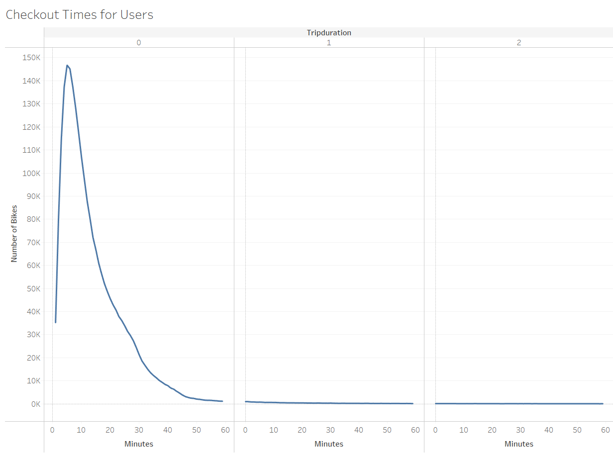
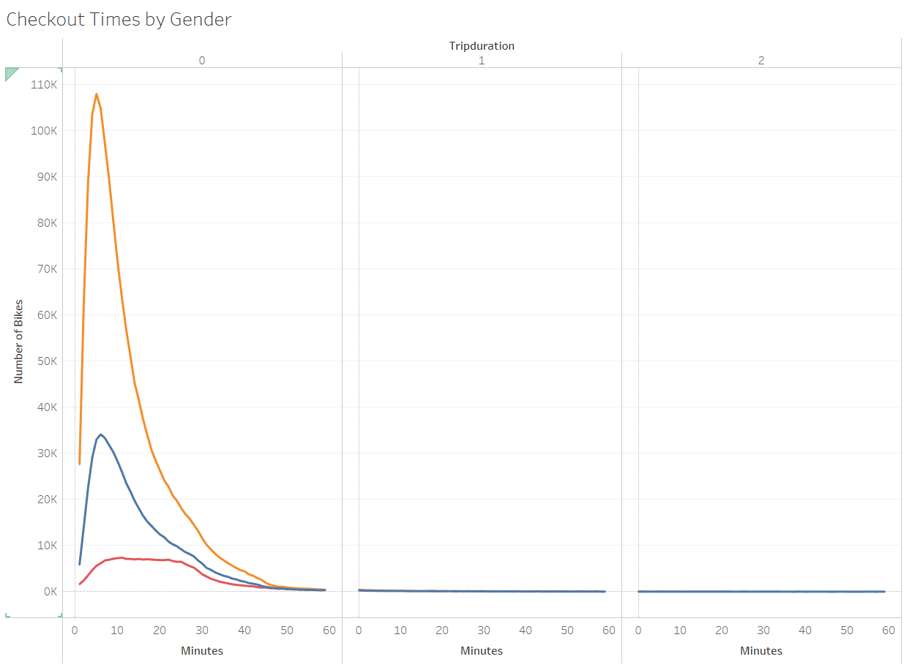
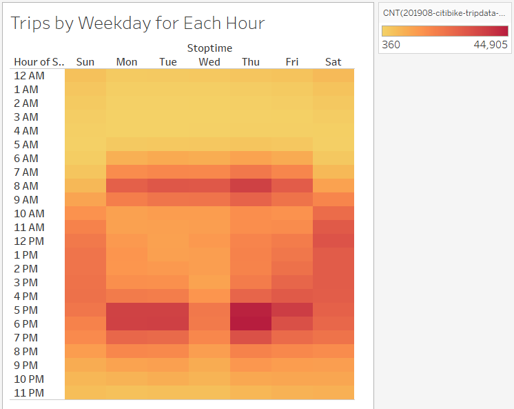
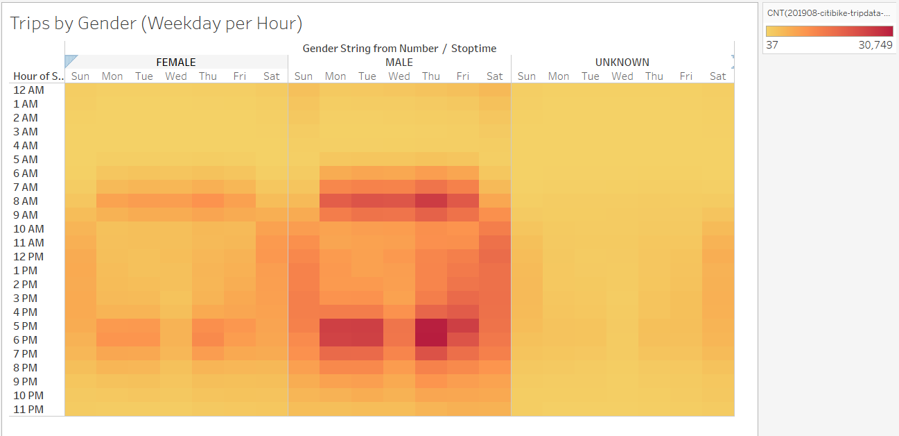
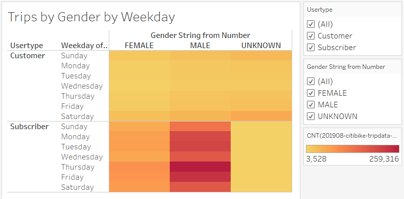
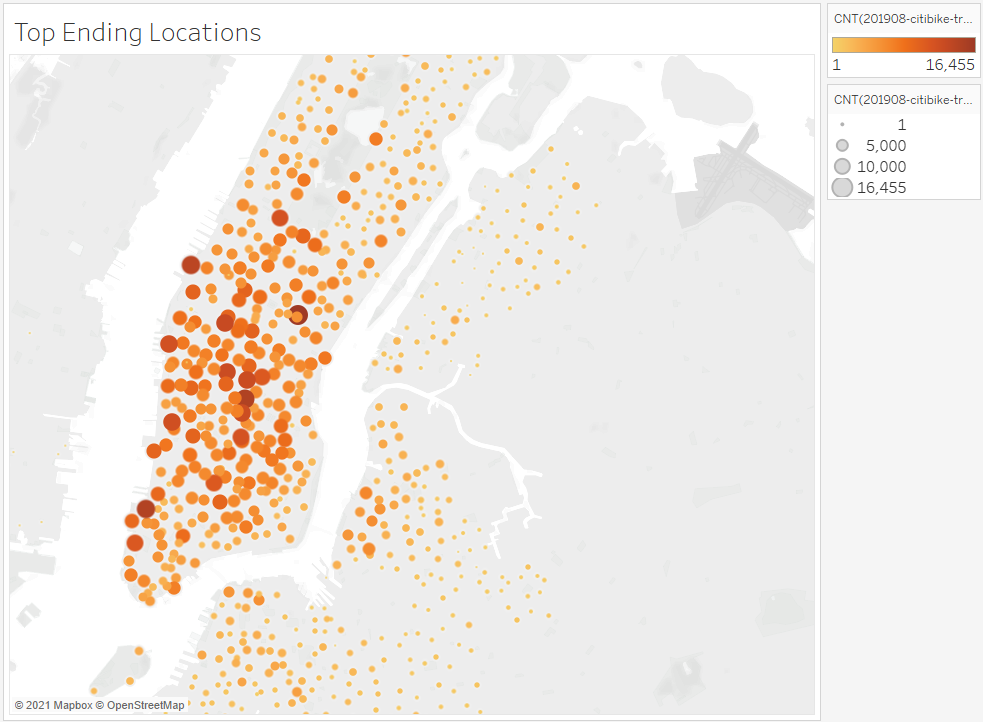
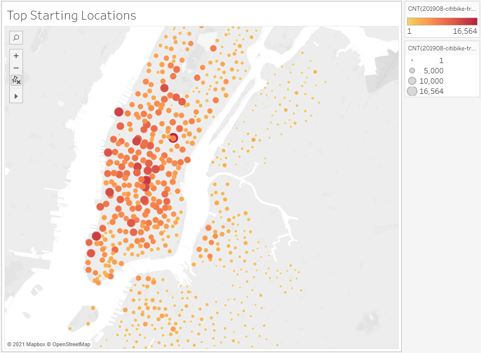

# Bikesharing in NYC
## Overview
The purpose of this analysis is to help answer the question: would a bike sharing service be viable in Des Moines, IA?

## Results

### Visualizations
Please refer to the [Tableau Story](https://public.tableau.com/app/profile/john.davidson5825/viz/ColumbiaDataAnalyticsBootcampModule14Challenge/NYCCitiBike?publish=yes) for an overview of the analysis.

Most bike trips are under 30 minutes, with a majority being around 5 minutes in duration.

The pattern for ride duration persists across all gender categories.

Trip stop times are concentrated around the start and end of the workday.

The stop time pattern persists for male and female users, concentrated around start and end of the workday

Most users are registered as male.  This could indicate majority male users, or that many subscribers share accounts with a primary account holder who is male.  Further, most users are subscribers which likely indicates that they use the system regularly and that they are not tourists.

The most used start stations are in Manhattan, which has the highest population density of all NYC buroughs according to [demographia.com](http://demographia.com/dm-nyc.htm).

The most used end stations are also in Manhattan.  Further, checking a few samples shows that the most used start stations are also the most used end stations.

### Conclusions
The data show that most users are male (or share an account with a male) subscribers that utilize the system primarily at the beginning and end of the work day.  Typical ride duration is in the range of 5-30 minutes.  The start/stop timing and duration persist for all genders.  Further, usage is concentrated in and around Manhattan.  This indicates that a new system in Des Moines should focus on putting bicycle stations in high population density neighborhoods whose residents tend to have a short commute to a nearby workplace, perhaps starting in the Des Moines downtown area.

## Additional Visualizations
To confirm the 
- Proximity of bicycle station locations to places of work.
- Proximity of bicycle station locations to residents.
- Demographics for NYC buroughs and Des Moines neighborhoods.